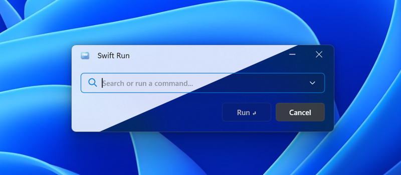

# ⚡ SwiftRun

**Blazing Fast Windows 11 Run Written in Rust**



This is a High Performance Rust Based Windows 11 Run Dialog Replacement with Modern UI and Hardware Accelerated Rendering with the Use of Win32 API. Written mostly with the help of Agentic AI and *"Vibe Coding"* in a couple of days.
```
proving even Microsoft doesn't know how to use AI right!
```

**Still in Beta Stage!**
I'm using Windows 11 25H2 and tested it here, so submit an issue if you have any with other versions of Windows 11.

---

## ✨ Features that Make a Difference

- **🤖 No AI Features!** : Everything is light-weight and fast, no need for Online Connectivity.
- **💎 Fluent Aesthetics**: Unlike Microsoft, the open-source community does a better job! Full support for Windows **Acrylic** transparency effects and rounded corners. It adapts to both **Light and Dark modes** based on your system settings.
- **🚀 Silky Smooth UI**: Everything is hardware accelerated. From the high-FPS entry animations to the sub-pixel font rendering.
- **⚡ Built with Rust**: Blazing fast, memory-safe, and incredibly lightweight. It’s there when you need it and invisible when you don’t.
- **🛠️ Zero-Config Hijack**: Once installed, SwiftRun takes over the `Win+R` shortcut automatically, replacing the system dialog with zero friction.

---

## ⌨️ Shortcuts

- **Win + R**: Open SwiftRun (replaces system Run).
- **Enter**: Run the command.
- **Esc**: Close SwiftRun.
- **Up / Down**: Cycle through command history.
- **Ctrl + Shift + Backspace**: Clear all command history.

---

## 🚀 Getting Started

SwiftRun is portable and easy to set up.

### 💾 Installation
Run the installation file and You are Good to Go:
```powershell
.\swift_run_Install.exe
```
This will set up the necessary registry hooks to autostart with Windows and bind the `Win+R` key to SwiftRun.

### 🗑️ Uninstallation
If you want to revert to the old Run dialog, run the uninstaller:
```powershell
.\swift_run_Uninstall.exe
```
It cleans up after itself perfectly, restoring the default Windows behavior.

---

## 🤝 Contributing

I built this because the old Run dialog was driving me crazy! If you're a Rustacean or a Windows UI enthusiast, I'd love your help! Feel free to open an issue or submit a PR.

Hit me up on Discord: Hamidr.b#1461

**If you want to see more parts of Windows 11 updated the way they were supposed to be 4 years ago, please support me with your donations!**

BTC: bc1qqyvc7yl43cy027dqvyzaa5zdz83tj0v5y0k7nk
ETH: 0xdfd3e7b9469872452d1f6c2919a5c59ad018a10a

---

